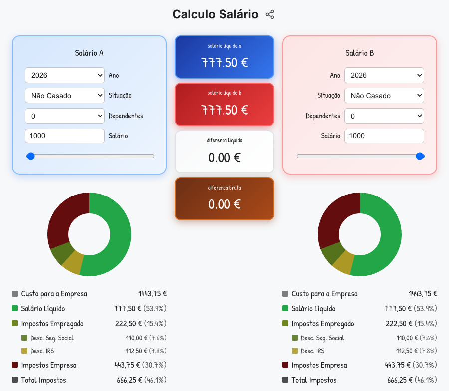

# React Salary Diff

A Portuguese salary calculator that compares two different salary scenarios side by side, showing the net salary difference after taxes and deductions.

## Features

- Compare two salary scenarios (A and B)
- Calculate net salary after taxes and deductions
- Show both net and gross difference
- Portuguese tax calculations using `salario-pt` library
- Interactive UI with double-click to copy values

## Tech Stack

- React + TypeScript
- Vite
- Portuguese salary calculations: `salario-pt`

## Getting Started

```bash
npm install
npm run dev
```

Open http://localhost:5173 to view the app.

## Deployment

The app is hosted on GitHub Pages at https://adrianojlt.github.io/react-salary-diff.

GitHub Pages serves the static files from the `gh-pages` branch. Deployment is handled in two ways:

**Automatic (GitHub Actions):** Every push to `master` triggers a workflow that builds the project and pushes the output to the `gh-pages` branch automatically.

**Manual:** You can also deploy locally by running:
```bash
npm run deploy
```
This builds the project and pushes the `dist/` folder to the `gh-pages` branch using the `gh-pages` npm package.

## Screenshot


